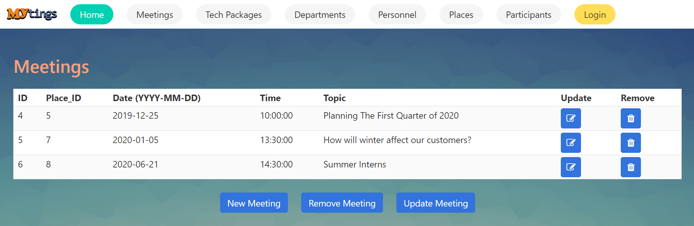

Parts Implemented by Gökay Temizkan
===================================
Home Page
---------

*This is the welcoming page of Mytings. Includes a commenting feature that visitors can rate the application and state their comments.*

Comments Section
~~~~~~~~~~~~~~~~

First of all, *Rate Us!* section greets you. In this section, anyone can add their honest comments and they can rate the website.
We recommend the users to enter a nickname instead of their full name.
	
	.. figure:: home_page_rate_us.png
		  :scale: 25 %
		  :alt: map to buried treasure

		  "Rate Us" section of the home page.
		  
Comments are represented in cards as below:

	.. figure:: home_page_cards.png
		  :scale: 30 %
		  :alt: map to buried treasure

		  Comment cards.
		  
Meetings Page
-------------

*The main table of the relational database of meetings named Meetings is represented here.*

		  Meetings table.

New Meeting Page
~~~~~~~~~~~~~~~~

This page can be accesed by clicking on the "New Meeting" button below the Meetings table.

A new meeting can be added in this page.

	.. figure:: meetings_page_add.png
			  :scale: 40 %
			  :alt: map to buried treasure

			  A new meeting can be added using the form.
			  
Input validation:
+++++++++++++++++

* Date cannot be past.
* Topic cannot be blank.