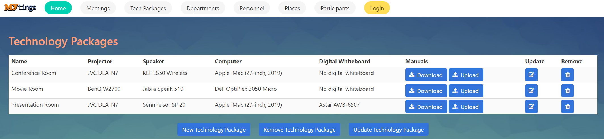

Parts Implemented by Gokay Temizkan
===================================
Home Page
---------

*This is the welcoming page of Mytings. Includes a commenting feature that visitors can rate the application and state their comments.*

Comments Section
~~~~~~~~~~~~~~~~

First of all, *Rate Us!* section greets you. In this section, anyone can add their honest comments and they can rate the website.
We recommend the users to enter a nickname instead of their full name.
	
	.. figure:: home_page_rate_us.png
		  :scale: 25 %
		  :alt: map to buried treasure

		  "Rate Us" section of the home page.
		  
Comments are represented in cards as below:

	.. figure:: home_page_cards.png
		  :scale: 30 %
		  :alt: map to buried treasure

		  Comment cards.
		  
Meetings Page
-------------

*The main table of the relational database of meetings named Meetings is represented here.*

.. figure:: meetings_page_table.png
		  :scale: 25 %
		  :alt: map to buried treasure

		  Meetings table.

New Meeting Page
~~~~~~~~~~~~~~~~

This page can be accesed by clicking on the "New Meeting" button below the Meetings table.

A new meeting can be added in this page.

	.. figure:: meetings_page_add.png
			  :scale: 40 %
			  :alt: map to buried treasure

			  A new meeting can be added using the form.
			  
Input validation:
+++++++++++++++++

* Date cannot be past.
* Topic cannot be blank.

Remove Meeting Page
~~~~~~~~~~~~~~~~~~~

This page can be accesed by clicking on the "Remove Meeting" button below the Meetings table.

A meeting can be removed in this page.

	.. figure:: meetings_page_remove.png
			  :scale: 40 %
			  :alt: map to buried treasure

			  A meeting can be removed by typing the ID of it in the form.

Update Meeting Page
~~~~~~~~~~~~~~~~~~~

This page can be accesed by clicking on the "Update Meeting" button below the Meetings table.

A meeting can be updated in this page.

First, you will encounter with the Find Meeting page.

	.. figure:: meetings_page_update_find.png
			  :scale: 40 %
			  :alt: map to buried treasure

			  A meeting can be found to update by typing the ID of it in the form.

Then, you will see the actual update page for the meeting searched, which is quite similar to Add Meeting page.

	.. figure:: meetings_page_update.png
			  :scale: 40 %
			  :alt: map to buried treasure

			  A meeting can be be updated the form.

Extra Features
~~~~~~~~~~~~~~

* Remove or Update pages can be accessed clicking the buttons on the right-hand-side of every row in the table.

	.. figure:: meetings_page_extras.png
			  :scale: 40 %
			  :alt: map to buried treasure

			  A meeting can be found to update by typing the ID of it in the form.

Tech Packages Page
-------------

*Tech table which includes several information about tach packages included in meeting rooms is represented here.*

		  Tech table.

New Technology Package Page
~~~~~~~~~~~~~~~~~~~~~~~~~~~